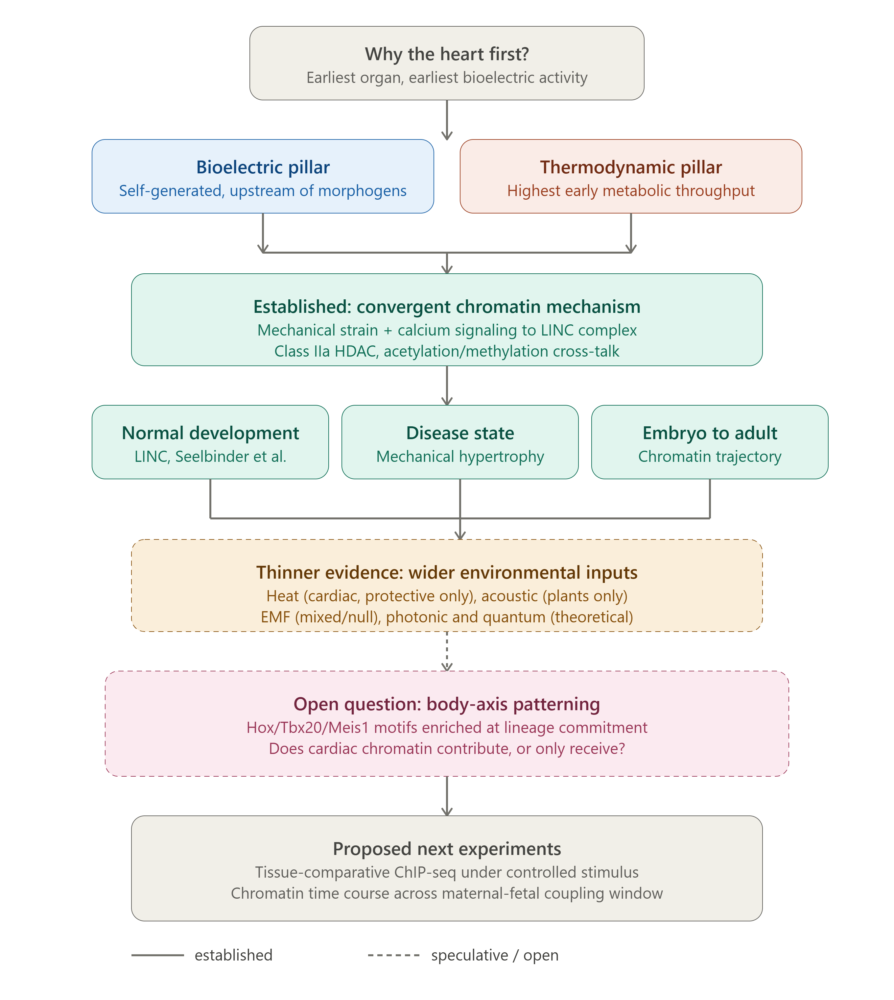

# Cardiac Epigenome and Environmental Signal Transduction

Draft mini review examining how mechanical, bioelectric, and metabolic 
signals converge on cardiac chromatin during development, and evaluating 
the evidence for acoustic, electromagnetic, and quantum-level inputs 
into the same system.

## Status
Work in progress. Draft manuscript, not yet submitted.

## Contents
- `manuscript/` — current draft text
- `references/` — reference list
- `figures/` — conceptual figure summarizing the proposed mechanism

## Scope
The review traces a chromatin-level pathway from mechanical and 
calcium signaling, through the LINC complex and class IIa HDAC, to 
specific histone marks at named cardiac gene loci, then considers 
whether this same machinery could plausibly respond to a wider class 
of environmental input, and whether early cardiac chromatin dynamics 
relate to body-axis patterning more broadly.

## Argument structure

The review moves from two converging lines of evidence for cardiac 
primacy, bioelectric and thermodynamic, through an established 
chromatin mechanism, to a clearly bounded set of open questions about 
wider environmental inputs and a possible role in body-axis patterning.
